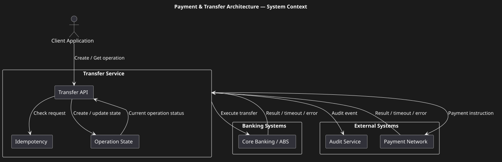
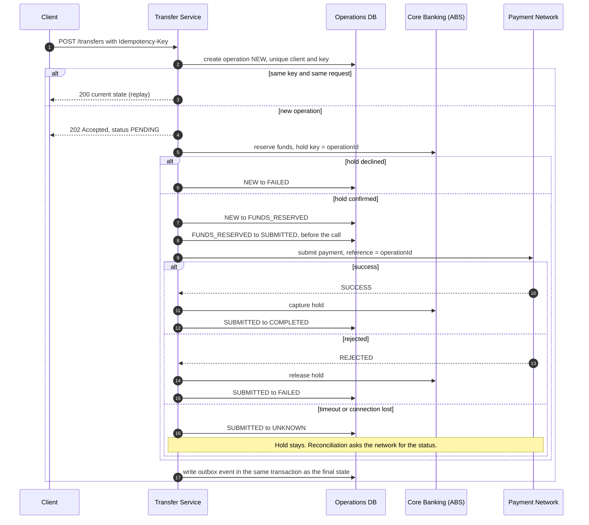
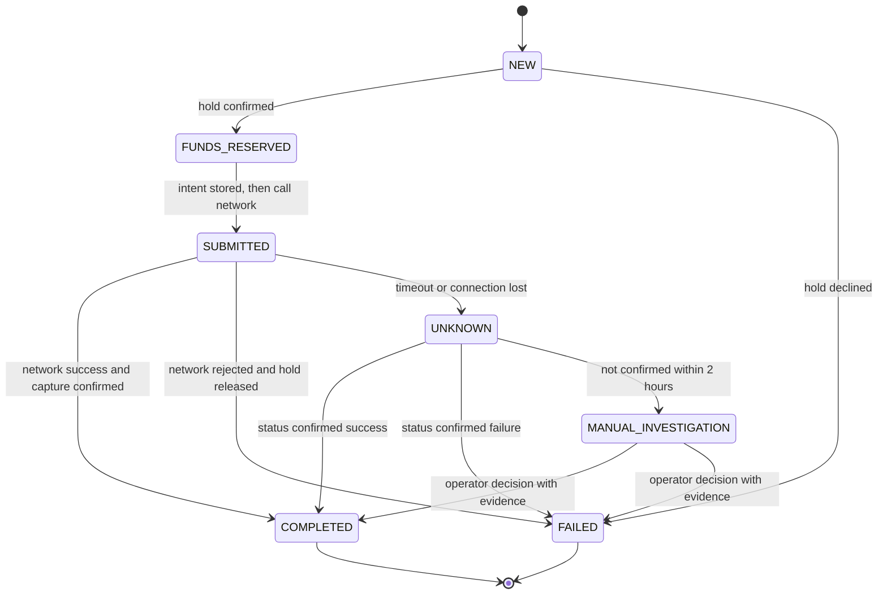
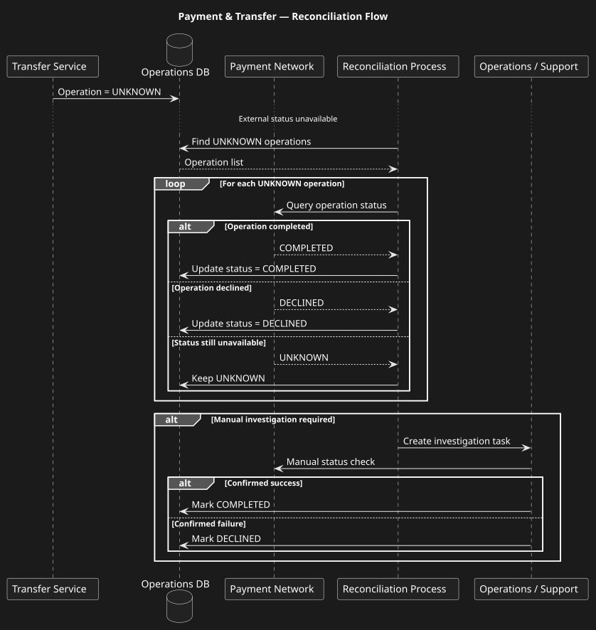

# Payment & Transfer Architecture

## Overview

A reference architecture for a transfer between a client channel, a Transfer Service, core banking (ABS) and an external payment network. The final result may arrive late or be lost. The main goals are: no duplicate payments, no lost money, one owner of the state and a clear way to recover.

> Portfolio note: this case is reconstructed and sanitised. It contains no confidential data. Numbers are reference values, not measurements.

## The problem

The payment network may accept a payment while the response never reaches the bank. If the bank treats the timeout as a failure and the customer retries, the customer can pay twice. If the bank treats it as success without proof, the money can be lost. The system must handle the uncertainty explicitly.

## Context

## Main flow

## Lifecycle

## Reconciliation

The diagram shows the reconciliation flow. In the current model, an operator decision goes through `MANUAL_INVESTIGATION` (see the state machine).

## Key decisions

1. The Transfer Service owns the operation state. ABS owns balances and holds. ([ADR-001](../adr/ADR-001-operation-state-ownership.md))
2. Intent is stored before every external call. `SUBMITTED` is written before the network call.
3. Funds are held first, then captured or released. ([money-flow.md](./money-flow.md))
4. A timeout moves the operation to `UNKNOWN`. It is never re-sent automatically. Reconciliation asks for the status.
5. Idempotency at every hop: client key, `operationId` for ABS and the network, `eventId` for consumers. ([idempotency.md](./idempotency.md))
6. Concurrency is controlled by optimistic locking with a version column. ([state-machine.md](./state-machine.md))
7. Events are published through a transactional outbox. ([ADR-005](../adr/ADR-005-transactional-outbox.md))
8. Clients see only `PENDING`, `COMPLETED`, `FAILED`. Internal states are not exposed.

## Documents

| Document | Content |
|---|---|
| [state-machine.md](./state-machine.md) | States, transitions, recovery, data model, locking |
| [money-flow.md](./money-flow.md) | What happens to the money in every outcome |
| [idempotency.md](./idempotency.md) | Keys, response rules, hops |
| [failure-scenarios.md](./failure-scenarios.md) | 18 failure scenarios |
| [reconciliation.md](./reconciliation.md) | Reconciliation flow and policy |
| [non-functional-requirements.md](./non-functional-requirements.md) | Reference numbers and alerts |
| [observability.md](./observability.md) | Metrics, logs, traces |
| [security.md](./security.md) | Security model |
| [artifacts/operation-state-model.md](./artifacts/operation-state-model.md) | Client status mapping |

Contracts: [OpenAPI](../03-integration-architecture/artifacts/openapi-example.yaml), [AsyncAPI](../02-event-driven-architecture/artifacts/asyncapi-example.yaml).

## Trade-offs

| Decision | Benefit | Cost |
|---|---|---|
| Central state in the Transfer Service | One truth, easy recovery and audit | The service is critical; it needs high availability (see ADR-001) |
| Hold and capture | No reversal on failure; money is safe during uncertainty | ABS must support holds; holds must expire safely |
| Status inquiry instead of re-send | No duplicate payments | Some operations stay `UNKNOWN` for minutes; support tooling is needed |
| Optimistic locking | No long locks, simple | Conflicts need a retry path |

## My role and contribution

Role: System Analyst / Senior System Analyst.

What I did in the real project (sanitised):

- TODO-FILL: what part of the real process you analysed and which decisions were yours (2–3 lines).
- TODO-FILL: which failure scenarios you found or added, and what changed because of that.
- TODO-FILL: the result you can state without confidential data (for example, fewer duplicate cases, faster recovery, a clearer support process).
