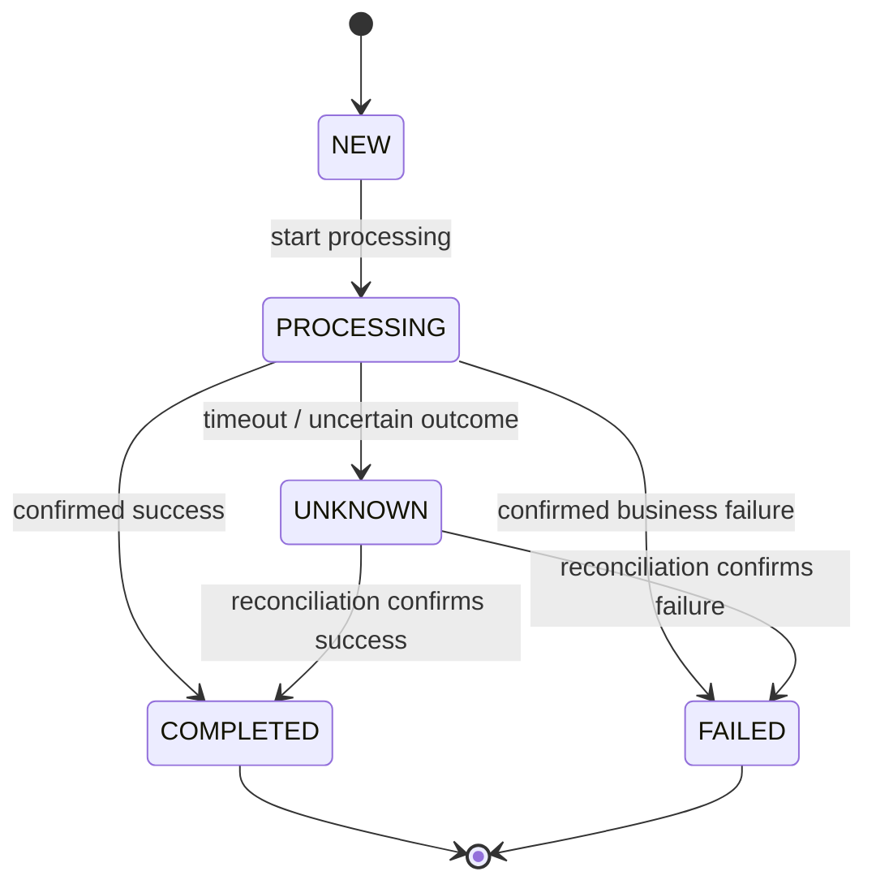

# Operation State Model

## Purpose

This artefact defines the authoritative lifecycle of a payment or transfer operation.

The model separates the internal operation state from customer-facing status labels.

## State Model

## State Definition

?

## Transition Rules

?

## Ownership
The Transfer Service owns the authoritative internal operation state.

Operational users and supporting components must not directly assign arbitrary state values.

All state changes must pass through the same transition validation rules.

## Unknown Outcome

UNKNOWN does not mean that the business operation failed.

It means that the system cannot currently establish the final external outcome.

This distinction prevents an uncertain operation from being incorrectly treated as a confirmed failure.

## Reconciliation

Operations in UNKNOWN are resolved through reconciliation.

The reconciliation process obtains the authoritative external status and requests a validated state transition.

## Client-facing Status

Client applications may map internal states to user-oriented statuses.

For example:

?

The client-facing status is not the authoritative operation state.

## Architectural Principle

One operation must have one authoritative current internal state and one controlled transition mechanism.
