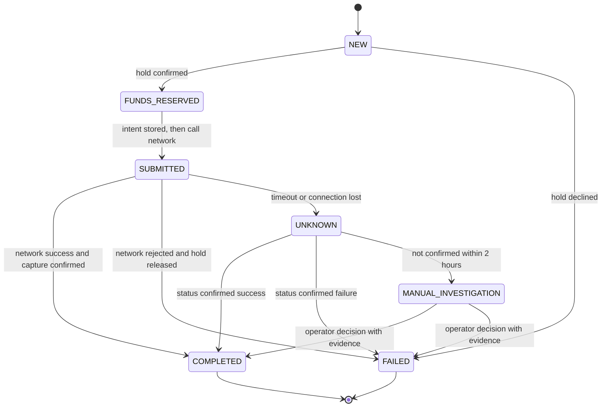

# State Machine

## Purpose

This document is the single source of truth for the transfer operation lifecycle. Diagrams, API contracts and other documents must follow it.

## Design rules

1. The Transfer Service is the only component that changes the operation state.
2. Intent is stored before every external call. `SUBMITTED` is written **before** the payment network is called.
3. `COMPLETED` and `FAILED` are terminal. A completed transfer is never changed. A return or refund is a **new operation** linked by `original_operation_id`.
4. A timeout is not a failure. It moves the operation to `UNKNOWN`.
5. Every transition is validated, stored in `operation_transition` and audited.
6. Manual actions use the same transitions as automatic ones.

## States

| State | Type | Money position | Meaning |
|---|---|---|---|
| NEW | Initial | None | Operation is accepted and stored. |
| FUNDS_RESERVED | Intermediate | Hold in ABS | Funds are held. Nothing is sent yet. |
| SUBMITTED | Intermediate | Hold in ABS | Payment is sent (or is about to be sent) to the network. Result is not known yet. |
| UNKNOWN | Recovery | Hold in ABS | Result is not known after a timeout or a lost connection. Reconciliation is running. |
| MANUAL_INVESTIGATION | Operational | Hold in ABS | Status was not confirmed within 2 hours. A human decides. |
| COMPLETED | Terminal | Captured (debited) | Network success confirmed and funds captured. |
| FAILED | Terminal | Released, or never held | Rejected or declined. No money is lost. |

## Diagram



## Transitions

| From | To | Trigger | Side effect |
|---|---|---|---|
| NEW | FUNDS_RESERVED | ABS confirms the hold | Store `hold_id` |
| NEW | FAILED | ABS declines (no funds, blocked account) | No money moved |
| FUNDS_RESERVED | SUBMITTED | Worker is ready to send | Store intent, then call the network |
| SUBMITTED | COMPLETED | Network success | Capture the hold; state changes only after capture is confirmed |
| SUBMITTED | FAILED | Network rejects | Release the hold |
| SUBMITTED | UNKNOWN | Timeout or connection lost | Keep the hold; start reconciliation |
| UNKNOWN | COMPLETED | Status inquiry confirms success | Capture the hold |
| UNKNOWN | FAILED | Status inquiry confirms failure | Release the hold |
| UNKNOWN | MANUAL_INVESTIGATION | No confirmed status within 2 hours | Create an investigation task |
| MANUAL_INVESTIGATION | COMPLETED / FAILED | Operator decision with evidence | Four-eyes approval; audit record |

Any other transition is invalid and returns a deterministic business error (`INVALID_STATE_TRANSITION`).

## Recovery of stuck operations

A recovery job runs every 30 seconds.

| Stuck state | Age | Action |
|---|---|---|
| NEW | > 30 s | Repeat the hold request with the same hold key (safe, idempotent). |
| FUNDS_RESERVED | > 30 s | Continue to `SUBMITTED` and send. Nothing was sent before. |
| SUBMITTED | > network timeout, no result | Move to `UNKNOWN`. Never send again automatically. |
| SUBMITTED with `network_result = SUCCESS` | > 10 min | Capture is failing. Retry capture and raise an alert. |

## Data model (PostgreSQL, simplified)

```sql
CREATE TABLE transfer_operation (
  operation_id          uuid PRIMARY KEY,
  client_id             text        NOT NULL,
  idempotency_key       text        NOT NULL,
  request_hash          char(64)    NOT NULL,   -- SHA-256 of the canonical request body
  state                 text        NOT NULL,
  version               integer     NOT NULL DEFAULT 0,
  amount_minor          bigint      NOT NULL CHECK (amount_minor > 0),
  currency              char(3)     NOT NULL,
  hold_id               text,
  network_ref           text,
  network_result        text,                   -- SUCCESS / REJECTED / null
  original_operation_id uuid,                   -- set for returns and refunds
  created_at            timestamptz NOT NULL DEFAULT now(),
  updated_at            timestamptz NOT NULL DEFAULT now(),
  UNIQUE (client_id, idempotency_key)
);

CREATE TABLE operation_transition (
  id            bigserial PRIMARY KEY,
  operation_id  uuid        NOT NULL REFERENCES transfer_operation(operation_id),
  from_state    text        NOT NULL,
  to_state      text        NOT NULL,
  trigger       text        NOT NULL,
  actor         text        NOT NULL,           -- service name or operator id
  correlation_id text,
  created_at    timestamptz NOT NULL DEFAULT now()
);
```

Amounts are stored as integer minor units (for example kopecks or cents), never as floating point.

## Concurrency: optimistic locking

Every transition is one conditional update inside one transaction:

```sql
UPDATE transfer_operation
SET state = :new_state, version = version + 1, updated_at = now()
WHERE operation_id = :id
  AND state = :expected_state
  AND version = :expected_version;
-- 1 row updated: the transition is applied. Insert the row into operation_transition in the same transaction.
-- 0 rows updated: another transaction changed the operation. Reload it and evaluate again.
```

Example: two transactions try to move an `UNKNOWN` operation, one to `COMPLETED` and one to `FAILED`. Only the first commit updates a row. The second one sees 0 rows, reloads the operation, finds a terminal state and returns a business error.
```

These transitions must be rejected.

The service should return a deterministic business error indicating that the requested state transition is not allowed.

## Transition Atomicity

A state transition must be performed atomically with the corresponding persistence operation.

Conceptually:

```text
BEGIN TRANSACTION

    Load operation
    Validate current state
    Validate requested transition
    Update operation state
    Persist transition metadata

COMMIT
```

If any required operation fails, the transaction must not leave a partially applied state transition.

## Concurrency

Two concurrent transition attempts for the same operation must not both succeed when they conflict with the state machine.

Example:

                 Operation = UNKNOWN
                       │
             ┌─────────┴─────────┐
             ▼                   ▼
       Transaction A       Transaction B
       → COMPLETED         → FAILED
             │                   │
             └─────────┬─────────┘
                       ▼
                DB concurrency
                   control

Only one valid transition may commit according to the transaction and locking strategy.

Principle

The state machine is the authoritative definition of allowed operation lifecycle transitions.

The client application may use different user-facing labels, but it must not redefine the underlying lifecycle.
