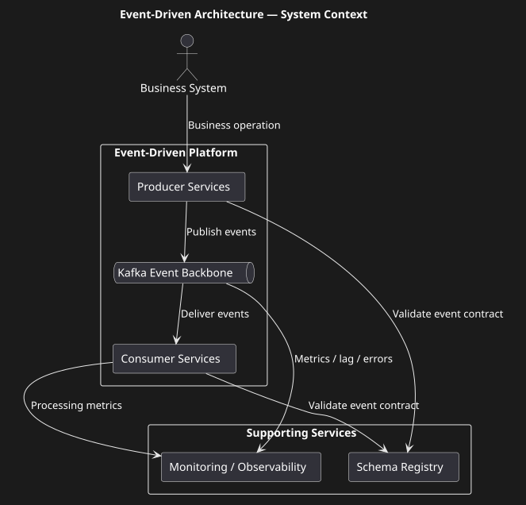
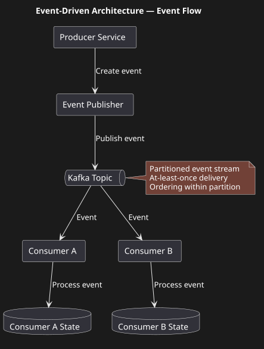
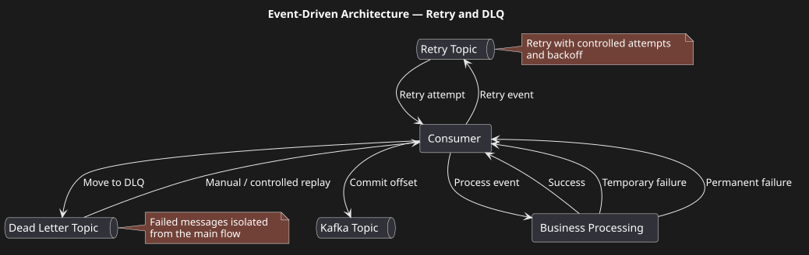
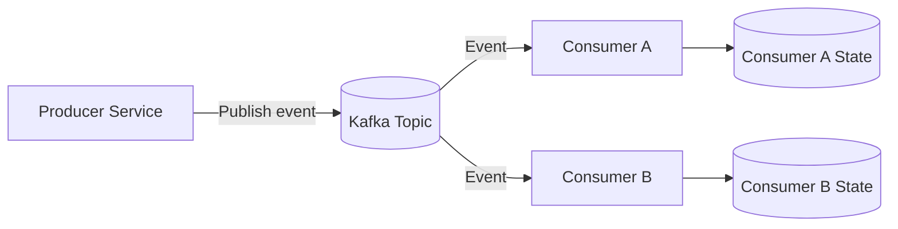
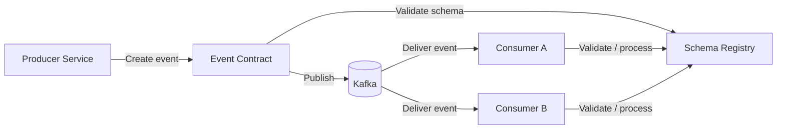
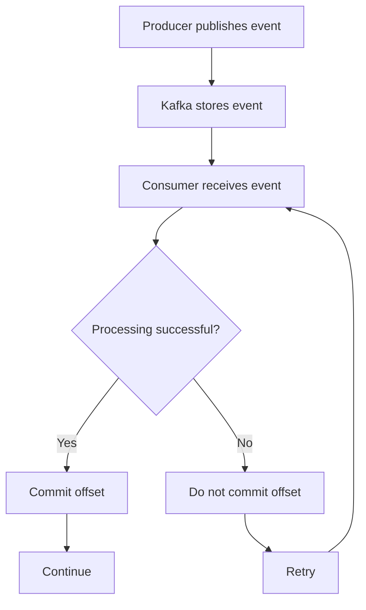
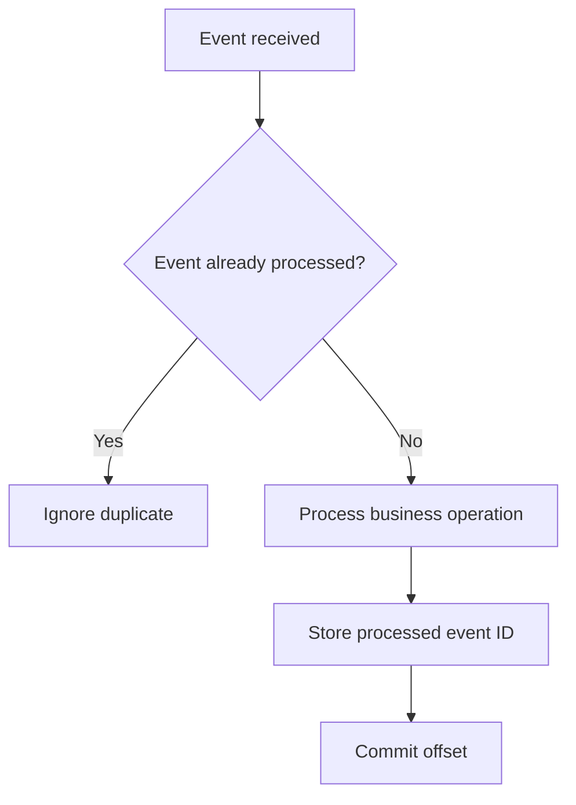
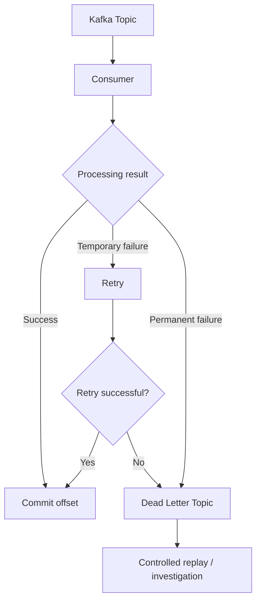
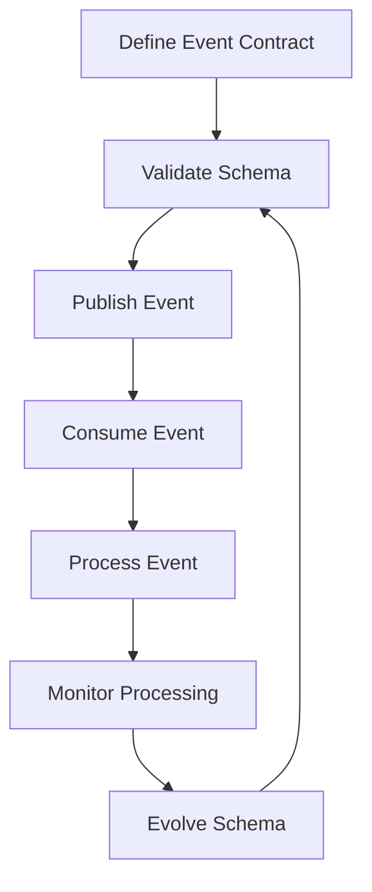

# Event-Driven Architecture with Kafka

## Overview

This case study demonstrates the design of an event-driven integration architecture using Apache Kafka as the messaging platform.

The architecture focuses on reliable asynchronous communication between independently deployed services.

The case addresses message delivery semantics, consumer behaviour, duplicate processing, ordering, retries, dead-letter handling, schema evolution and observability.

## Business Problem

A distributed platform contains multiple services that need to react to changes in business state.

Direct synchronous communication between all participants would create tight coupling and increase dependency on the availability and response time of downstream services.

An event-driven approach allows services to communicate asynchronously while remaining independently deployable.

## Architecture Diagrams

### System Context



### Event Flow



### Retry and DLQ



## Analytical Artifacts

### AsyncAPI Event Contract

A sanitised AsyncAPI 3.0.0 contract defines two events (`TransferCompleted`, `TransferFailed`), the Kafka key (`operationId`), retry and dead-letter channels, and the schema evolution rule. Money is a decimal string.

[View AsyncAPI Contract](./artifacts/asyncapi-example.yaml)

### Transactional Outbox

Events are published through a transactional outbox to avoid the dual-write problem. See [outbox.md](./outbox.md) and [ADR-005](../adr/ADR-005-transactional-outbox.md).

A runnable proof of concept of this pattern (with tests) is here: [outbox-idempotency-poc](https://github.com/konstantin-kuzovkin/outbox-idempotency-poc)

## Architectural Goals

The solution should provide:

• asynchronous communication;
• loose coupling between producers and consumers;
• reliable event delivery;
• controlled duplicate processing;
• predictable ordering where required;
• independent consumer scaling;
• retry and failure handling;
• dead-letter processing;
• schema evolution;
• operational visibility.

## High-Level Architecture



### Why Events?

Events are used when the producer does not need to synchronously control the consumer’s processing.

For example:

```text id="y5td2s"
OrderCreated
PaymentCompleted
CustomerUpdated
TransferCompleted
DocumentSigned
```

The producer publishes the fact that something happened.

Consumers independently decide whether and how they should react.

## Kafka Responsibilities

Kafka provides the transport and persistence mechanism for events.

The architecture relies on Kafka for:

• durable event storage;
• partitioned event streams;
• consumer groups;
• offset management;
• scalable consumption;
• replay capability where appropriate.

Kafka does not provide the business semantics of the event itself.

## Event Contract

An event should contain a stable business contract.

Example:

```json
{
  "eventId": "unique-event-id",
  "eventType": "TransferCompleted",
  "eventVersion": 1,
  "occurredAt": "2026-01-01T12:00:00Z",
  "operationId": "operation-id",
  "correlationId": "correlation-id",
  "payload": {}
}
```

The exact payload is intentionally simplified for portfolio purposes.

An event is treated as a versioned integration contract between the producer and its consumers.


Contract Principles

* Event structure is explicitly defined.
* Producers and consumers are decoupled through the event contract.
* Schema changes must consider existing consumers.
* Backward compatibility should be preferred where possible.
* Breaking changes require an explicit migration strategy.
* Consumers should not depend on undocumented producer implementation details.

## Delivery Semantics

The architecture assumes that consumers must be prepared for duplicate delivery.

Therefore, consumers should be designed to process events idempotently.



## Idempotent Consumer

Because the delivery model is at-least-once, a consumer may receive the same event more than once.

The consumer therefore needs a mechanism to detect already processed events before applying another business effect.


The exact idempotency mechanism depends on the business operation and persistence model.

## Ordering

Kafka guarantees ordering within a partition.

Therefore, when business ordering matters, related events should use a consistent partitioning key.

Example:

```text id="0x7z8g"
operation_id
     │
     ▼
partition key
     │
     ▼
same Kafka partition
     │
     ▼
preserved order
```

Ordering across independent partitions is not assumed.

## Consumer Groups

Each logical consuming application uses its own consumer group.

For example:

```text id="vqip5b"
Topic: transfer-events

Group: audit-service
  └── Consumer instances

Group: notification-service
  └── Consumer instances

Group: analytics-service
  └── Consumer instances
```

Each consumer group receives the event stream independently.

## Retry

Temporary failures should not immediately result in message loss.

A retry strategy may use:

• retry attempts;
• backoff;
• delayed retry topics;
• controlled redelivery.

Retries must be bounded.

## Dead Letter Queue

Events that cannot be successfully processed after the configured retry policy may be redirected to a dead-letter flow.

### Retry and Dead Letter Queue


The DLQ must be monitored and have an operational recovery process.

## Schema Evolution

Event contracts evolve over time.

The architecture therefore requires compatibility rules for producers and consumers.

A producer should not introduce breaking changes without considering existing consumers.

Possible strategies include:

• backward-compatible changes;
• additive fields;
• explicit event versions;
• migration periods for consumers.

## Event Lifecycle


The lifecycle emphasizes that event contracts are part of the engineering process rather than a one-time implementation artifact.

## Observability

Each event should be traceable using identifiers such as:

• event ID;
• operation ID;
• correlation ID;
• trace ID;
• event type;
• event version.

Important metrics include:

• consumer lag;
• processing latency;
• processing failures;
• retry count;
• DLQ volume;
• duplicate event rate.

## Key Architectural Principles

1. Kafka is treated as an event transport platform, not as business logic.
2. Events represent facts that have occurred.
3. Consumers are independently responsible for processing events.
4. Consumers must tolerate duplicate delivery.
5. Ordering is guaranteed only within a partition.
6. Partition keys must reflect business ordering requirements.
7. Retries must be bounded.
8. Failed messages require controlled dead-letter handling.
9. Event contracts must support evolution.
10. Operational visibility is part of the architecture.

## Architecture Highlights

### 1. Event Contract Ownership

Events are treated as explicit integration contracts rather than implementation details.

### 2. At-Least-Once Delivery

The architecture assumes that an event may be delivered more than once.

Consumers therefore need idempotent processing.

### 3. Partition-Level Ordering

Ordering is guaranteed only within a Kafka partition.

The partitioning strategy must therefore be aligned with the business ordering requirement.

### 4. Retry Isolation

Retry processing is separated from the main event flow.

Temporary failures should not block healthy events indefinitely.

### 5. Dead Letter Queue

Messages that cannot be processed successfully are isolated in a DLQ rather than repeatedly blocking the main processing flow.

### 6. Schema Evolution

Event schemas must evolve in a controlled and backward-compatible way.

### 7. Observability

Production readiness requires visibility into:

- consumer lag;
- processing latency;
- processing failures;
- retry volume;
- DLQ volume;
- event throughput.

## What I Personally Contributed

The case reflects my experience and approach to designing Kafka-based integration solutions.

Key areas include:

• analysis of synchronous versus asynchronous interaction;
• definition of event contracts;
• Kafka topic and consumer interaction modelling;
• analysis of delivery semantics;
• idempotent consumer design;
• failure and retry scenarios;
• DLQ strategy;
• event ordering;
• schema evolution;
• observability requirements;
• technical documentation and integration standards.

## My Role

Role: System Analyst / Architecture-oriented System Analyst

Responsibilities

• event model analysis;
• Kafka integration design;
• event contract definition;
• delivery semantics analysis;
• partitioning and ordering analysis;
• retry and DLQ design;
• idempotent consumer analysis;
• schema evolution analysis.

## Key Trade-offs

### Event-Driven vs. Synchronous Communication

**Benefits:**

- loose coupling;
- asynchronous processing;
- independent consumers;
- scalable event distribution.

**Trade-offs:**

- eventual consistency;
- more complex error handling;
- harder end-to-end debugging;
- additional operational complexity.

### At-Least-Once vs. Exactly-Once

The architecture prefers at-least-once delivery combined with idempotent consumers.

This avoids relying on exactly-once semantics as the primary business guarantee.

**Trade-off:**

Consumers must explicitly handle duplicate events.

### Retry vs. Immediate Failure

Temporary failures should be retried.

Permanent failures should eventually be isolated in a DLQ.

This requires distinguishing transient failures from non-retryable business or contract errors.
