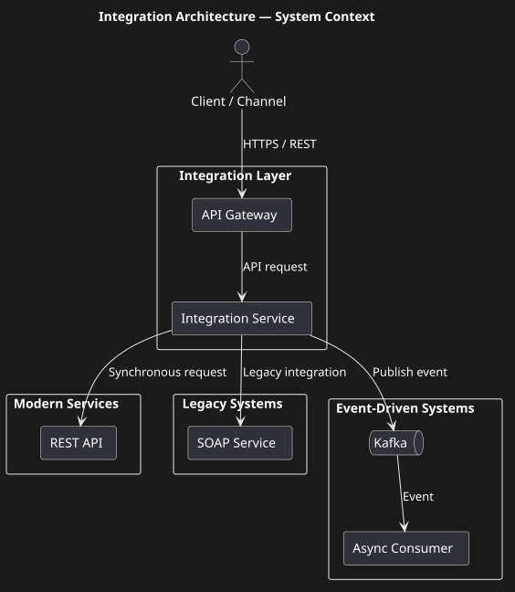
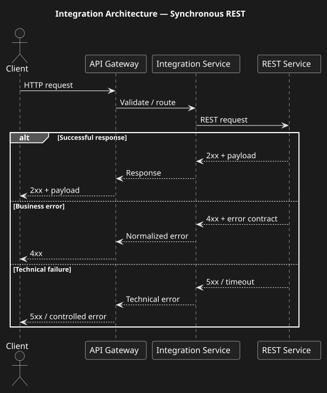
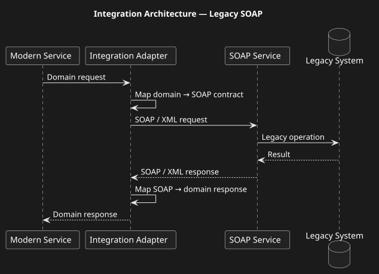
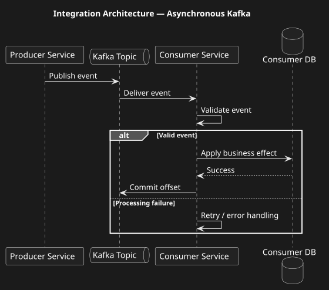
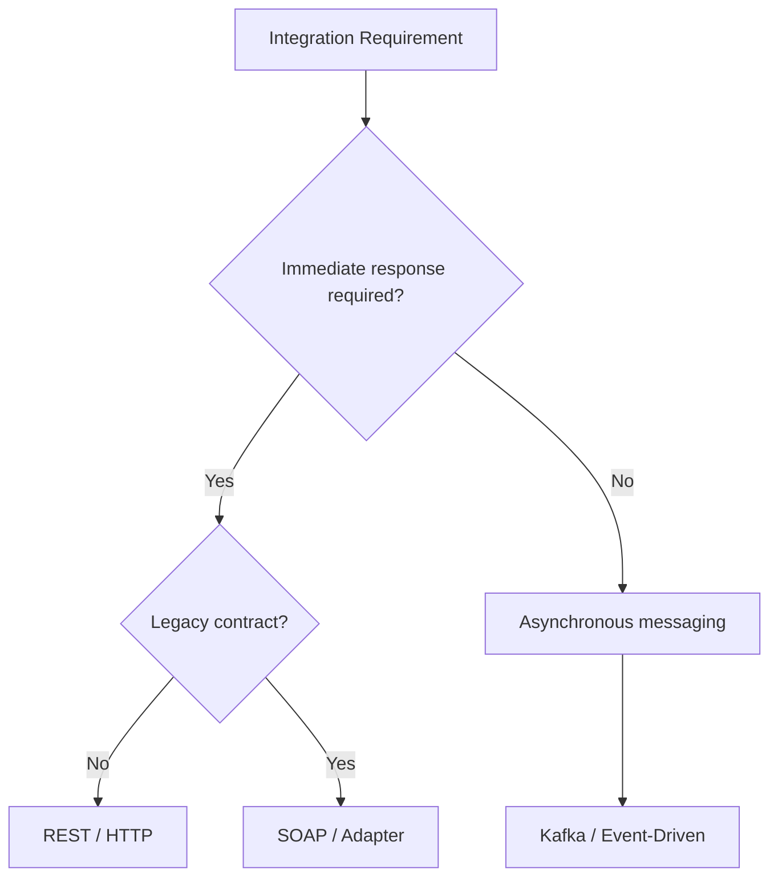

## Integration Architecture

Overview

This case study demonstrates an integration architecture combining synchronous REST APIs, legacy SOAP integrations and asynchronous event-driven communication.

The objective is to demonstrate how integration patterns are selected according to business requirements, consistency needs, latency expectations and characteristics of downstream systems.

> **Portfolio note:** This is a sanitized and reconstructed architecture case. It does not contain confidential information, production endpoints, internal system names, credentials or proprietary implementation details.

## Business Context

A modern microservice platform often needs to integrate with systems based on different technologies and communication models.

A single business process may therefore involve:

• modern REST services;
• legacy SOAP systems;
• asynchronous Kafka events;
• authentication and authorisation services;
• external systems requiring mutual TLS.

The architecture must provide a consistent integration approach despite these technical differences.

## Architecture Diagrams

### System Context



### Synchronous REST



### Legacy SOAP



### Asynchronous Kafka



## Architectural Problem

The main question is not:

> Which technology should be used?

The main question is:

> Which interaction pattern best matches the business and technical requirements of a particular integration?

## Integration Patterns

|Pattern         |Typical Use                                        |
|----------------|---------------------------------------------------|
|REST            |Synchronous request/response                       |
|SOAP            |Integration with legacy or contract-heavy systems  |
|Kafka           |Asynchronous event-driven communication            |
|mTLS            |Strong service-to-service / external authentication|
|JWT / OAuth/OIDC|Identity and access control                        |

### Integration Pattern Selection


## Integration Decision Matrix

| Requirement | REST | SOAP | Kafka |
|---|---:|---:|---:|
| Immediate response | Yes | Yes | No |
| Request / response | Yes | Yes | No |
| Legacy integration | Sometimes | Yes | Rarely |
| Asynchronous processing | No | Rarely | Yes |
| Event distribution | No | No | Yes |
| Loose coupling | Medium | Low / Medium | High |
| Eventual consistency | Rare | Rare | Common |
| Independent consumers | No | No | Yes |
| Contract-based integration | Yes | Yes | Yes |

## Architecture Highlights

### 1. Pattern Selection Based on Requirements

Integration technology is selected based on interaction characteristics rather than technology preference.

### 2. REST for Synchronous APIs

REST is appropriate when the caller requires an immediate response and the operation fits a request/response model.

### 3. SOAP for Legacy or Contract-Heavy Integration

SOAP can remain appropriate when integration with an existing enterprise or legacy system requires a stable XML/WSDL-based contract.

### 4. Kafka for Asynchronous Communication

Kafka is appropriate when the producer and consumer should be decoupled in time and the system benefits from event distribution and asynchronous processing.

### 5. Adapter Around Legacy Systems

Legacy protocols and data models should be isolated behind an adapter rather than propagated through the modern domain model.

### 6. Explicit Error Contracts

Business errors and technical failures should be represented separately.

### 7. Security at Integration Boundaries

Authentication, authorization and transport security should be considered at each integration boundary rather than treated as an afterthought.

## High-Level Architecture

```text
                         ┌─────────────────────┐
                         │     Client / API    │
                         └──────────┬──────────┘
                                    │
                                    ▼
                         ┌─────────────────────┐
                         │   Integration      │
                         │      Service       │
                         └──────┬────┬────┬───┘
                                │    │    │
                   ┌────────────┘    │    └─────────────┐
                   ▼                 ▼                  ▼
              REST API             SOAP              Kafka
                   │                 │                  │
                   ▼                 ▼                  ▼
             Microservice       Legacy System     Event Platform

                         ┌─────────────────────┐
                         │ Security Boundary   │
                         │ JWT / mTLS / Auth   │
                         └─────────────────────┘
```

## REST Integration

REST is appropriate when the caller requires a synchronous response.

Typical characteristics:

• request/response;
• immediate validation;
• explicit API contract;
• HTTP status codes;
• synchronous error handling.

## SOAP Integration

SOAP may be appropriate when integrating with legacy or contract-oriented systems.

Typical characteristics:

• XML-based messages;
• WSDL-driven contract;
• strict schemas;
• enterprise legacy compatibility.

The architecture should isolate legacy-specific concerns from modern domain services where practical.

## Kafka Integration

Kafka is appropriate when:

• asynchronous processing is acceptable;
• consumers should be temporally decoupled;
• multiple consumers may react independently;
• event replay is useful;
• producer availability should not depend on immediate consumer availability.

## Security

The architecture may use different security mechanisms depending on the integration boundary.

Examples:

• JWT for authenticated API access;
• OAuth/OIDC for identity;
• mTLS for strong service-to-service authentication;
• certificate-based authentication for selected external integrations.

## Error Handling

Errors are classified into:

• validation errors;
• authentication/authorisation errors;
• business errors;
• technical errors;
• timeout;
• downstream unavailable;
• unknown result.

The error model should be consistent at the API boundary even when downstream systems use different technical error representations.

## Reliability

Integration reliability is addressed through:

• timeouts;
• controlled retries;
• idempotency;
• circuit breaking where appropriate;
• asynchronous processing;
• reconciliation where the final outcome is uncertain.

## API Contract

The API contract should define:

• operations;
• request structure;
• response structure;
• validation rules;
• error model;
• authentication requirements;
• idempotency requirements;
• versioning strategy.

OpenAPI can be used as the formal API contract.

## Observability

Each integration should support correlation across participating systems.

Recommended identifiers:

• request ID;
• correlation ID;
• operation ID;
• trace ID.

## Key Architectural Principles

1. Select integration patterns based on business requirements.
2. Keep synchronous and asynchronous responsibilities explicit.
3. Isolate legacy integration complexity.
4. Treat API contracts as first-class architecture artefacts.
5. Define errors explicitly.
6. Apply security appropriate to each trust boundary.
7. Design for downstream failures.
8. Make integrations observable.
9. Avoid technology-driven architecture decisions.
10. Document significant integration decisions through ADRs.

## What I Personally Contributed

The case reflects my approach to integration architecture and system analysis.

Key areas include:

• decomposition of integration scenarios;
• selection of synchronous versus asynchronous patterns;
• REST API contract design;
• SOAP integration analysis;
• Kafka integration modelling;
• security requirements;
• error handling;
• timeout and retry scenarios;
• idempotency requirements;
• sequence diagrams;
• OpenAPI-oriented technical documentation;
• integration standards.

## My Role

Role: System Analyst / Integration-oriented System Analyst

Responsibilities

• integration pattern selection;
• API contract design;
• REST/OpenAPI analysis;
• SOAP/XML integration analysis;
• Kafka integration analysis;
• security boundary analysis;
• error handling;
• reliability analysis.

## What This Case Demonstrates

• REST integration
• OpenAPI contracts
• SOAP/XML integration
• Kafka integration
• API versioning
• Error taxonomy
• Authentication and authorisation
• mTLS
• Reliability patterns
• Integration trade-offs

> **Portfolio note:** This is a reconstructed and sanitised portfolio case created to demonstrate architectural reasoning and system analysis practices. It is not a copy of a production system.

## Key Trade-offs

### REST

**Advantages:**

- simple request/response model;
- widely supported;
- easy client integration.

**Trade-offs:**

- temporal coupling;
- caller depends on service availability;
- synchronous failures propagate to the caller.

### SOAP

**Advantages:**

- explicit contract;
- mature enterprise integration model;
- suitable for legacy systems.

**Trade-offs:**

- verbose XML payloads;
- tighter contract coupling;
- additional transformation complexity.

### Kafka

**Advantages:**

- asynchronous communication;
- loose temporal coupling;
- multiple independent consumers;
- scalable event distribution.

**Trade-offs:**

- eventual consistency;
- more complex failure handling;
- duplicate processing must be considered;
- end-to-end debugging is harder.

## Interview Talking Points

1. How do you choose between REST, SOAP and Kafka?

2. When is synchronous communication preferable?

3. When is asynchronous communication preferable?

4. What are the consequences of temporal coupling?

5. Why should a legacy SOAP contract be isolated behind an adapter?

6. How would you normalize errors from different integration protocols?

7. Where should authentication and authorization be enforced?

8. When would mTLS be required?

9. How do OAuth2, OIDC and JWT fit into an API integration architecture?

10. What happens when a synchronous downstream service times out?

11. What happens when a Kafka consumer fails after processing an event?

12. How should API contracts evolve?

13. How should event contracts evolve?

14. What are the observability requirements for REST and Kafka integrations?

15. What trade-offs would you present to an Architecture Review Board?
