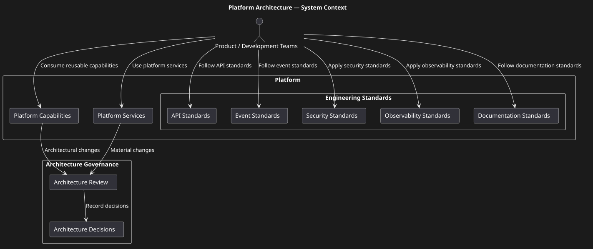
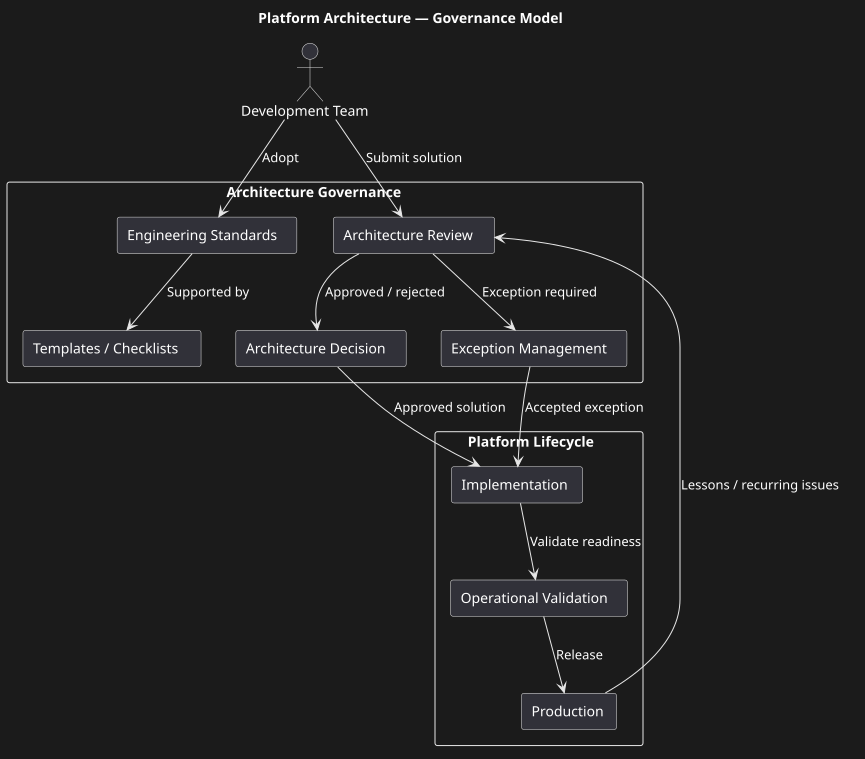
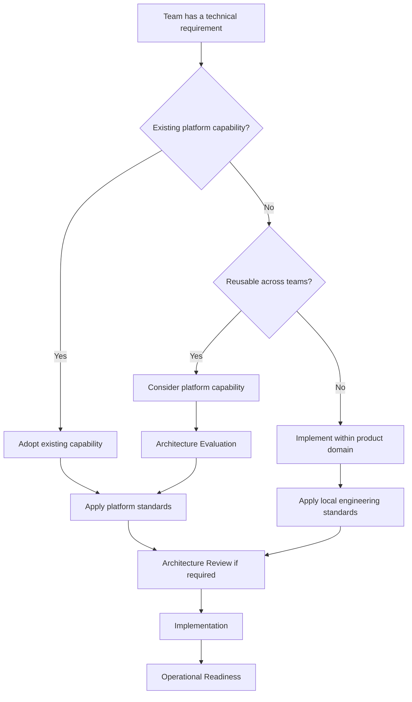
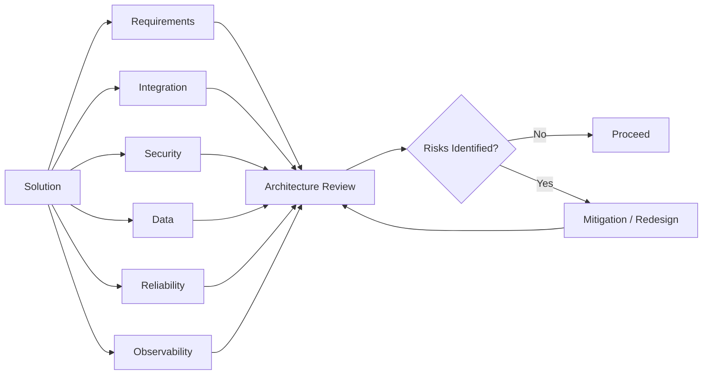

# Platform Architecture & Engineering Standards

Overview

This case study demonstrates the design and adoption of common architectural and engineering standards across a large microservice platform.

The objective is to reduce architectural inconsistency between development teams and establish reusable practices for API design, event integration, documentation, service architecture and operational readiness.

> **Portfolio note:** This is a sanitized representation of platform practices. Numbers and examples are intentionally generalized and no proprietary standards, internal service names or confidential information are included.

# Platform Context

The platform supports multiple product domains and development teams.

The environment contains:

• approximately 40 internal development teams;
• approximately 10 product domains;
• more than 90 microservices;
• more than 30 developers involved in the platform ecosystem;
• approximately 20 system analysts;
• approximately 20 product owners.

The scale creates a challenge that cannot be solved by reviewing every individual implementation manually.

A reusable standards-based approach is required.

# Problem

As the number of teams and services grows, several problems may appear:

• inconsistent API design;
• different error models;
• inconsistent Kafka usage;
• different documentation structures;
• duplicated architectural decisions;
• inconsistent security approaches;
• different naming conventions;
• incomplete operational requirements;
• difficult onboarding of new teams.

The platform therefore requires a common engineering baseline.

# Objective

Create a reusable set of architectural standards and templates that can be applied by multiple development teams.

The standards should cover:

```text
Service
  │
  ├── API
  ├── Events
  ├── Security
  ├── Database
  ├── Observability
  ├── Documentation
  └── Operational readiness
```

# Approach

The platform approach consists of four layers.

```text
┌───────────────────────────────┐
│ Architecture Principles       │
├───────────────────────────────┤
│ Engineering Standards         │
├───────────────────────────────┤
│ Reusable Templates            │
├───────────────────────────────┤
│ Review / Governance           │
└───────────────────────────────┘
```

# Architecture Principles

## Architecture Diagrams

### Platform Context



### Governance Model



## Architecture Highlights

### 1. Platform as an Enabler

The platform provides reusable capabilities and engineering guardrails rather than owning business functionality.

### 2. Standards as Reusable Engineering Assets

Standards are supported by templates, checklists and examples so that teams can apply them consistently.

### 3. Governance Without Centralized Bottlenecks

Architecture governance should focus on material risks and reusable architectural decisions rather than reviewing every implementation detail.

### 4. Explicit Ownership

Platform capabilities should have clear ownership, lifecycle and operational responsibility.

### 5. API and Event Consistency

Common API and event standards reduce integration ambiguity across multiple teams.

### 6. Security by Default

Authentication, authorization, transport security and service boundaries should be considered as part of the platform model.

### 7. Operational Readiness

A platform capability is incomplete without observability, failure handling, documentation and support procedures.

### 8. Documentation as an Engineering Artifact

Architecture and engineering documentation should evolve together with the platform rather than being created only at the end of implementation.

## Platform Decision Flow


The platform standards are based on principles such as:

• explicit service ownership;
• clear API contracts;
• explicit integration boundaries;
• asynchronous communication where appropriate;
• secure-by-design integration;
• observable services;
• documented architectural decisions;
• backward-compatible evolution;
• automation where possible.

## Architecture Review Model

Architecture review is used to identify material risks before implementation or production rollout.



# Standards

Standards define the expected baseline for:

• REST APIs;
• Kafka events;
• error handling;
• security;
• logging;
• metrics;
• documentation;
• service structure.

# Templates

Templates convert abstract standards into practical development artefacts.

Examples:

• service README;
• API checklist;
• event checklist;
• architecture review template;
• operational readiness checklist.

# Governance

Governance should not become a bureaucratic approval process.

The objective is to identify important architectural risks early and provide reusable guidance to teams.

# Personal Contribution

My contribution to this type of platform work includes:

• development of common analysis and documentation standards;
• creation of reusable templates;
• definition of API and integration documentation practices;
• alignment of standards between analysts and development teams;
• training and knowledge sharing;
• participation in architecture and technical discussions;
• improvement of consistency across services;
• development of reusable analytical approaches.

# Expected Benefits

A common platform standard can provide:

• faster onboarding;
• more predictable architecture;
• reduced duplication;
• improved documentation quality;
• easier cross-team integration;
• easier architecture review;
• improved operational readiness.

# Key Principle

> **At platform scale, architecture is not only about designing systems. It is also about creating mechanisms that allow many teams to design systems consistently.**

## Key Trade-offs

### Centralized Platform vs Team Autonomy

A centralized platform can provide consistency and reuse, but excessive centralization can slow product teams down.

### Standardization vs Flexibility

Strict standards reduce architectural variation but can become a constraint when legitimate exceptions exist.

### Reuse vs Complexity

A reusable capability is valuable when multiple teams have a stable common requirement.

Premature generalization can create unnecessary platform complexity.

### Governance vs Delivery Speed

Architecture governance should reduce material architectural risk without turning every development decision into an approval workflow.

### Shared Capability vs Business Ownership

Technical capabilities can be shared while business rules remain owned by the corresponding product domains.

## My Role

**Role:** System Analyst / Architecture-oriented System Analyst

In this case, I focused on:

- platform architecture analysis;
- engineering standards;
- reusable API and event standards;
- architecture governance;
- architecture review practices;
- documentation standards;
- reusable templates and checklists;
- platform onboarding;
- architecture decision-making.

> **Portfolio note:** This is a reconstructed and sanitised portfolio case created to demonstrate architectural reasoning, platform engineering practices and system analysis skills. It is not a copy of a production platform or internal documentation.

## Interview Talking Points

1. What makes a platform different from a shared technical service?

2. When should functionality become a platform capability?

3. When should a team keep functionality inside its own domain?

4. How do you prevent a platform from becoming a bottleneck?

5. How do you design platform standards?

6. How do you make standards actually adopted by development teams?

7. What should an architecture review check?

8. Which architectural decisions require governance?

9. How do you handle exceptions to platform standards?

10. How do you balance standardization and team autonomy?

11. How should platform capabilities be versioned?

12. Who owns a platform capability after production release?

13. What operational requirements should a platform capability have?

14. How do you measure whether a platform capability is actually reusable?

15. How would you explain the value of a platform to product teams?
