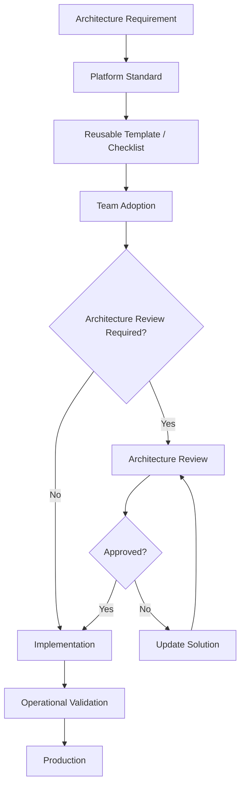

# Architecture Governance

## Purpose

Architecture governance exists to provide consistency and reduce architectural risk without unnecessarily slowing development teams.

## Governance Model

```text
Team
  │
  ▼
Architecture / Technical Analysis
  │
  ▼
Standards & Checklists
  │
  ▼
Architecture Review
  │
  ▼
Implementation
  │
  ▼
Operational Feedback
  │
  └──────────────► Standards Evolution
```

## Review Levels

### Level 1 — Standard Change

The solution follows existing platform patterns.

Review should be lightweight.

### Level 2 — Significant Change

The solution introduces meaningful integration, data or operational complexity.

A deeper technical review is appropriate.

### Level 3 — Architectural Change

The solution introduces a new platform pattern or significant architectural deviation.

An explicit architecture decision should be documented.

## ADR

Important architectural decisions should be recorded as ADRs.

An ADR should explain:

• context;
• problem;
• considered alternatives;
• decision;
• consequences.

## Governance Model

Platform governance defines how standards and architectural decisions are introduced, reviewed and evolved.


## Governance Principles

* Standards should be explicit and versioned.
* Reusable templates should reduce interpretation differences.
* Architecture reviews should focus on material architectural risks.
* Governance should not become a mandatory approval step for every technical change.
* Exceptions should be documented rather than silently bypassing standards.
* Standards should evolve based on recurring engineering problems.
