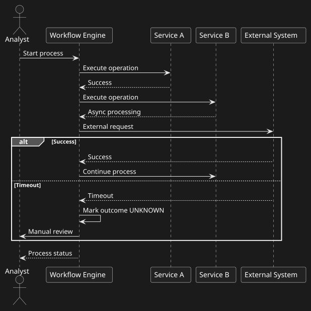
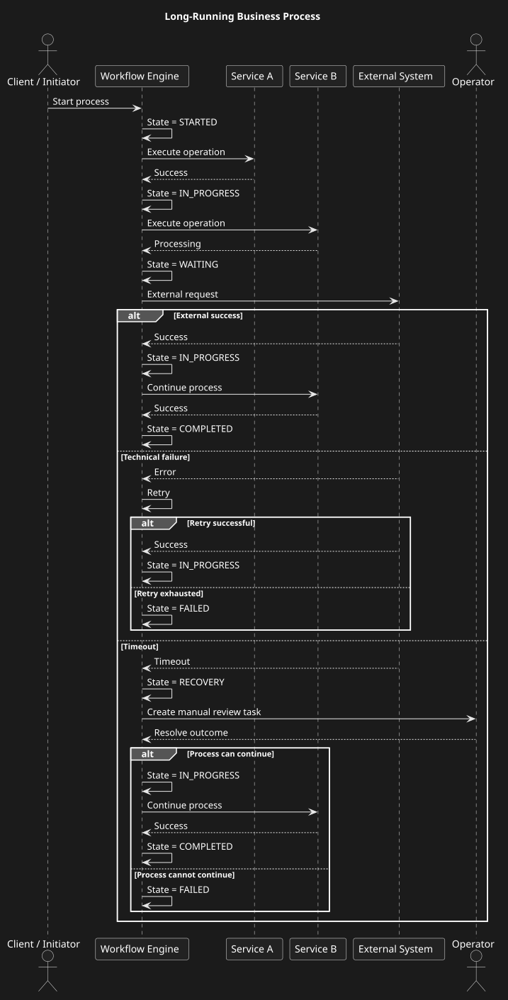
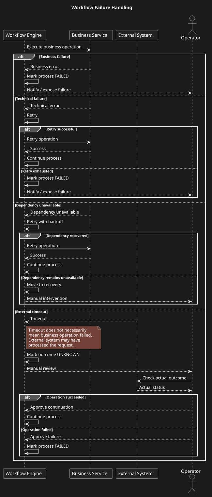
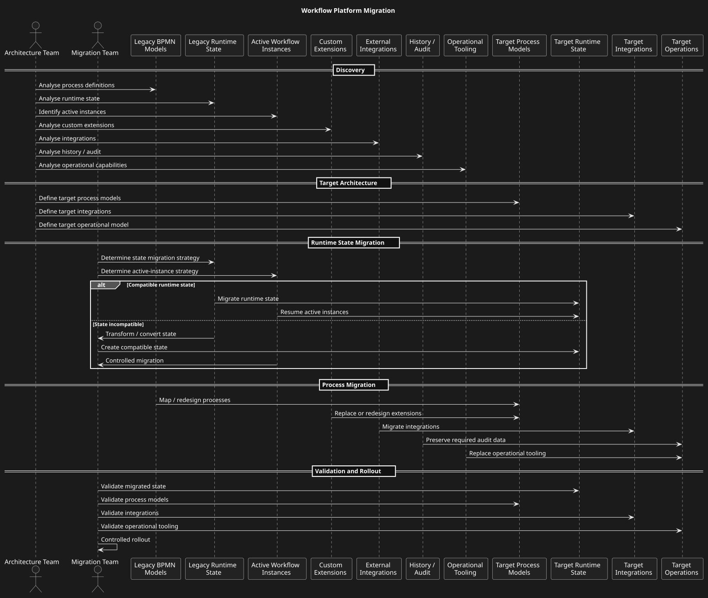
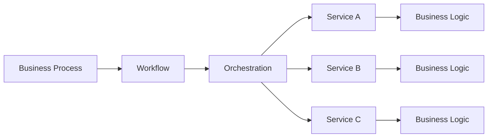

# Workflow & Process Orchestration Architecture

## Overview

This case study explores the architecture of long-running business processes in distributed systems.

The focus is not on a specific workflow product but on architectural decisions around:

• workflow orchestration;
• process state;
• BPMN;
• retries;
• timeouts;
• compensation;
• human tasks;
• failure recovery;
• observability;
• workflow engine selection;
• migration from legacy workflow platforms.

## Architecture Context

> A workflow engine should orchestrate business processes without becoming the owner of business capabilities implemented by domain services.

Long-running business processes require explicit management of process state, retries, timeouts, failures and recovery.

The workflow engine is treated as an infrastructure component responsible for process execution and orchestration.

Business services remain responsible for their own business operations and domain rules.

The architecture therefore separates:

- process orchestration;
- business logic;
- process state;
- technical failure handling;
- compensation;
- human tasks;
- observability.

## Problem

Modern distributed systems frequently contain business processes that span multiple services and may run for seconds, minutes, hours or days.

A process can involve:

• synchronous APIs;
• asynchronous events;
• external systems;
• human decisions;
• retries;
• timeouts;
• compensating actions;
• manual recovery.

A simple synchronous request/response model is insufficient for these scenarios.

## Objective

Design an architecture that provides:

1. explicit process definition;
2. durable process state;
3. controlled orchestration;
4. failure recovery;
5. retry and timeout handling;
6. compensation;
7. operational visibility;
8. human task support;
9. controlled evolution of process definitions.

## Core Concept

The workflow engine is responsible for the lifecycle of the process.

Business services remain responsible for their own business capabilities.

```text
Workflow Engine
       │
       ├── Service A
       ├── Service B
       ├── External System
       └── Human Task
```

The engine coordinates the process but should not become a replacement for domain services.
## Architecture Diagrams

The case includes the following architecture diagrams:

### 1. Workflow Orchestration

Shows the central workflow engine coordinating business services and external systems, including timeout handling and transition to manual review.



Source: [orchestration.puml](diagrams/orchestration.puml)

### 2. Long-Running Process

Shows the lifecycle of a long-running business process, including process states, retries, timeout recovery and manual intervention.



Source: [process.puml](diagrams/process.puml)

### 3. Failure Handling

Shows the distinction between business failure, technical failure, dependency unavailability and unknown external outcome.



Source: [failure-handling.puml](diagrams/failure-handling.puml)

### 4. Workflow Platform Migration

Shows the analysis and migration path from a legacy workflow platform to a target platform, including runtime state, active instances, integrations, extensions, audit and operational tooling.



Source: [migration.puml](diagrams/migration.puml)
## Orchestration vs Choreography

Orchestration

A central workflow component controls the process.

```text
          Workflow
          Engine
        /    |     \
       /     |      \
 Service A Service B Service C
```

Advantages:

• explicit process flow;
• centralized visibility;
• easier process monitoring;
• easier handling of long-running processes.

Potential disadvantages:

• orchestration component can become a bottleneck;
• excessive centralization may increase coupling.

Choreography

Services react to events independently.

```text
Service A
   │
   ▼
 Event
   │
   ▼
Service B
   │
   ▼
 Event
   │
   ▼
Service C
```

Advantages:

• loose coupling;
• autonomous services.

Potential disadvantages:

• process flow becomes harder to understand;
• operational troubleshooting becomes more difficult;
• global process state may be difficult to reconstruct.

## Decision Principle

Workflow describes the execution of a business process.

Orchestration defines how multiple services and process steps are coordinated to achieve the business outcome.

The workflow engine should coordinate the process without becoming the owner of domain business rules.


Responsibility Boundary

Workflow / Orchestrator:

* process sequencing;
* state transitions;
* retries;
* timeouts;
* waiting;
* compensation coordination;
* human task coordination.

Business Services:

* business rules;
* validation;
* domain operations;
* persistence of domain data;
* domain-specific decisions.

## State Management

A long-running workflow requires durable state.

Conceptually:

```text
STARTED
   ↓
IN_PROGRESS
   ↓
WAITING
   ↓
COMPLETED
```

Failure paths must be explicitly modelled.

```text
IN_PROGRESS
     │
     ├── SUCCESS → COMPLETED
     │
     ├── RETRY → IN_PROGRESS
     │
     ├── TIMEOUT → RECOVERY
     │
     └── FAILURE → FAILED
```

## Failure Handling

A workflow should distinguish between:

• business failure;
• technical failure;
• timeout;
• unavailable dependency;
• unknown external outcome.

A timeout does not necessarily mean that the business operation failed.

This is particularly important when external systems may have processed a request before the response was lost.

## Compensation

Distributed workflows cannot rely on a traditional ACID transaction across all services.

Instead, a process may require compensating actions.

Example:

```text
Reserve Resource
      ↓
Create Operation
      ↓
Process Payment
      ↓
Send Notification
```

If payment fails after resource reservation:

```text
Payment FAILED
      ↓
Compensation
      ↓
Release Resource
```

Compensation is a business operation, not a database rollback.

## Human Tasks

Some processes require manual intervention.

Example:

```text
External outcome = UNKNOWN
          ↓
Create manual review task
          ↓
Operator investigates
          ↓
Approved transition
          ↓
Process continues
```

The operator should not be allowed to arbitrarily modify process state.

Allowed transitions must be explicitly defined.

## Observability

A workflow platform should provide visibility into:

• process instances;
• current state;
• failed activities;
• retries;
• waiting states;
• execution duration;
• external dependencies;
• manual interventions.

Correlation identifiers should allow a process instance to be traced across services.

## Workflow Engine Selection

Technology selection should consider:

• BPMN support;
• long-running workflows;
• persistence model;
• retries;
• timers;
• compensation;
• human tasks;
• operational tooling;
• developer experience;
• scalability;
• availability;
• integration model;
• migration complexity;
• team expertise;
• licensing and support.

## Migration

When migrating from an existing workflow platform, the migration should not be treated as a simple technical version upgrade.

The analysis should consider:

• existing BPMN models;
• runtime state;
• process instances already in progress;
• external integrations;
• custom extensions;
• operational tooling;
• history/audit;
• deployment model;
• compatibility;
• team skills;
• target architecture.

## Result

The architecture provides a structured approach for designing, evaluating and evolving workflow orchestration in distributed systems.

The case demonstrates understanding of both business-process modelling and distributed-system reliability.

## My Role

Role: System Analyst / Architecture-oriented System Analyst

Responsibilities

• workflow and process analysis;
• business process modelling;
• BPMN process design;
• process state analysis;
• failure and recovery analysis;
• compensation design;
• human-task modelling;
• workflow engine evaluation;
• technology comparison;
• architecture decision analysis;
• technical documentation.

