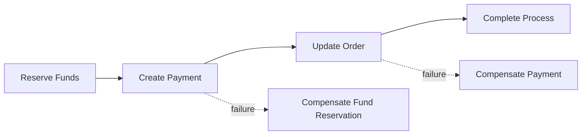

# Compensation

## Purpose

A long-running distributed business process may involve multiple independent services.

A single ACID transaction normally cannot span all participating systems.

When a later step fails, previously completed operations may therefore require compensating business actions.

## Compensation vs Rollback

Compensation is not the same as database rollback.

A database rollback restores changes inside one transactional boundary.

Compensation performs a new business operation intended to reduce or reverse the effect of an earlier operation.

Example:

```text
Transaction:

BEGIN
    Operation A
    Operation B
    Operation C
COMMIT
```

This model is not normally possible across independent services.

Instead:

```text
Operation A
    ↓
Operation B
    ↓
Operation C
    ↓
Failure
    ↓
Compensation
```

##Example

Consider a simplified payment process:



If the payment is created successfully but the order update fails, the process may require a compensating action.

## Compensation Actions

Examples include:

• release reservation;
• cancel payment;
• reverse authorization;
• restore inventory;
• cancel external request;
• create manual investigation task.

The exact action depends on the business semantics of the operation.

## Compensation Ownership

The workflow coordinates compensation.

The business service owns the implementation and business semantics of its compensating operation.

For example:

```text
Workflow
    |
    | compensate
    v
Payment Service
    |
    └── Cancel Payment
```

The workflow should not implement payment-domain business rules itself.

## Compensation State

Compensation should have explicit state.

Example:

```text
FAILED
   ↓
COMPENSATING
   ↓
COMPENSATED
```

If compensation fails:

```text
FAILED
   ↓
COMPENSATING
   ↓
COMPENSATION_FAILED
   ↓
MANUAL_REVIEW
```

## Compensation Failure

Compensation itself may fail because of:

• external system unavailability;
• timeout;
• business restriction;
• inconsistent external state;
• already completed operation;
• unavailable dependency.

The architecture must define what happens in this case.

Possible actions include:

• retry compensation;
• reconcile external state;
• create a manual task;
• escalate;
• terminate process with explicit unresolved state.

## Compensation Is Not Guaranteed

Compensation does not guarantee that the system returns to exactly the previous state.

For example:

```text
Original state
    ↓
Operation
    ↓
External side effect
    ↓
Compensation
```

The external system may have generated:

• notifications;
• audit events;
• fees;
• timestamps;
• external references;
• downstream side effects.

Some of these effects may be irreversible.

## Irreversible Operations

Some operations cannot be compensated automatically.

Examples:

• sending an external notification;
• completing an irreversible settlement;
• triggering a regulatory process;
• performing an external action with no cancellation API.

Such operations require explicit architectural handling.

Possible approaches include:

• manual resolution;
• process continuation;
• compensating business action;
• separate reconciliation process.

## Compensation Idempotency

Compensation operations may also need to be idempotent.

Example:

```text
Cancel Payment #123
        ↓
Timeout
        ↓
Retry Cancel Payment #123
```

The payment service should avoid producing inconsistent results when the same compensation request is repeated.

## Compensation Observability

Every compensation action should be observable.

Useful information includes:

• process ID;
• business operation ID;
• original operation;
• compensation operation;
• reason;
• attempt number;
• result;
• timestamp;
• external operation ID.

## Compensation Principles

• Compensation is a business operation, not a database rollback.
• Compensation must have explicit semantics.
• The workflow coordinates compensation.
• Business services own compensating operations.
• Compensation may itself fail.
• Compensation should be idempotent where appropriate.
• Irreversible operations require explicit handling.
• Compensation must be observable and auditable.
• Manual resolution should be modeled explicitly when automatic compensation is impossible.
