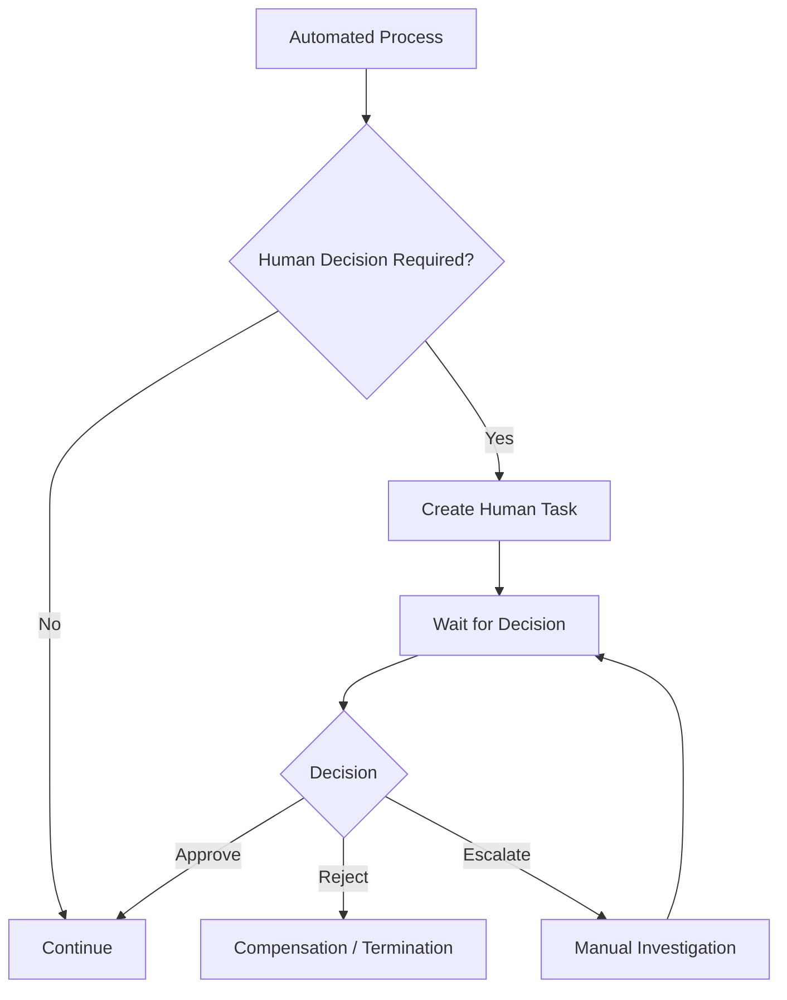

# Human Tasks

## Purpose

Not every business process can be fully automated.

Some processes require:

• business approval;
• operational investigation;
• manual verification;
• exception handling;
• regulatory decision;
• customer-support intervention.

Human interaction should therefore be modeled as an explicit part of the process.

## Human Task as a Process State

A human task should not be represented as an undocumented pause.

Instead, the process should enter an explicit waiting state.

Example:

```text
Automated Process
       ↓
Human Decision Required
       ↓
Human Task Created
       ↓
WAITING_FOR_HUMAN_ACTION
       ↓
Decision
       ↓
Process Continues
```

## Human Task Flow



## Human Task Data

A human task should have explicit metadata.

Typical fields include:

• task ID;
• process instance ID;
• business operation ID;
• responsible role;
• assigned user where applicable;
• task status;
• creation timestamp;
• due date;
• SLA;
• available actions;
• reason;
• process context;
• audit information.

## Task Lifecycle

A simplified lifecycle may be:

```text
CREATED
   ↓
ASSIGNED
   ↓
IN_PROGRESS
   ↓
COMPLETED
```

Alternative states may include:

```text
ESCALATED
CANCELLED
EXPIRED
REJECTED
```

The exact state model depends on the business process.

## SLA and Timeout

A human task may have an SLA.

For example:

```text
Task created
    ↓
Waiting
    ↓
SLA approaching
    ↓
Escalation
    ↓
Manual resolution
```

The process should define what happens when the task is not completed within the expected time.

Possible actions:

• notify responsible role;
• escalate to another role;
• create an operational incident;
• terminate the process;
• continue with a predefined fallback;
• move to manual investigation.

## Authorization

Human actions should respect authorization boundaries.

The process should distinguish:

• who can view the task;
• who can perform an action;
• who can approve;
• who can reject;
• who can escalate.

The workflow engine should not replace the organization’s authorization model.

## Audit

Human decisions may have business and regulatory significance.

The system should therefore record:

• who performed the action;
• what action was performed;
• when it happened;
• what process instance was affected;
• previous state;
• resulting state;
• relevant business context.

Recoverability

A process should remain recoverable if:

• the user closes the application;
• the task remains unattended;
• the assigned user becomes unavailable;
• the workflow engine restarts;
• the task is reassigned;
• the SLA expires.

Human tasks therefore require durable state.

## Manual Investigation

Some cases cannot be resolved through a predefined human decision.

For example:

```text
External operation = UNKNOWN
          ↓
Automatic reconciliation failed
          ↓
MANUAL_INVESTIGATION
          ↓
Operator checks external system
          ↓
Confirmed result
          ↓
Process transition
```

Manual investigation should be a controlled process state rather than an undocumented operational workaround.

## Human Task Principles

• Human interaction should be explicitly modeled.
• Human tasks require durable state.
• Every task should have a clear owner or responsible role.
• Available actions should be explicit.
• Authorization must be enforced.
• SLA and escalation rules should be defined.
• Human actions should be audited.
• Manual investigation should have a controlled lifecycle.
• The process must remain recoverable while waiting for human action.
