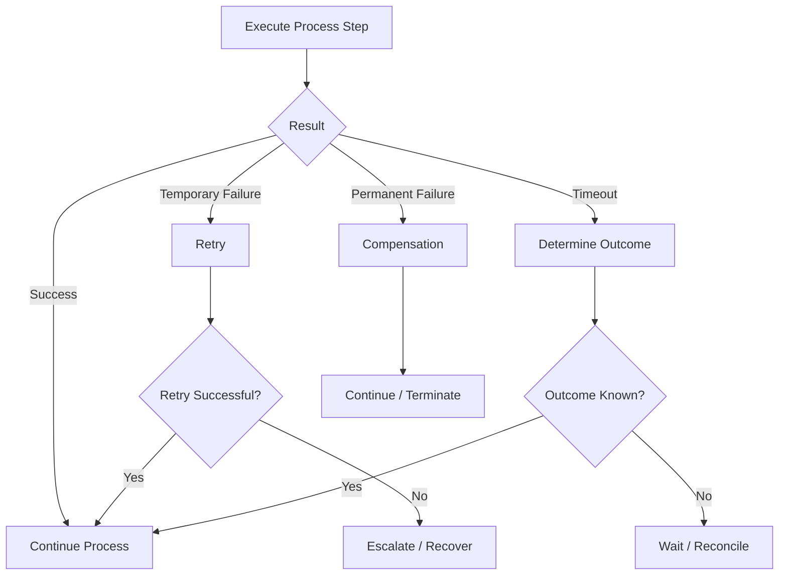

# Process Reliability

## Purpose

Long-running business processes must be designed for partial failures.

A process may depend on multiple services, databases, external systems and human decisions.

The architecture therefore treats failures as expected scenarios rather than exceptional events.

## Typical Failure Types

A workflow step may fail because of:

• network timeout;
• service unavailable;
• temporary infrastructure failure;
• validation error;
• business rejection;
• duplicate request;
• message delivery problem;
• external system uncertainty;
• workflow-engine failure;
• human-task timeout.

Different failure types require different recovery strategies.

## Failure Classification

### Transient Failure

A temporary technical failure that may succeed later.

Examples:

• temporary network problem;
• service unavailable;
• database connection failure;
• temporary resource exhaustion.

Typical response:

```text
Retry
```

### Permanent Technical Failure

A technical problem that is unlikely to succeed without intervention.

Examples:

• invalid configuration;
• unsupported operation;
• incompatible contract.

Typical response:

```text
Stop → Escalate / Manual Investigation
```

### Business Failure

The operation is technically processed but cannot be completed because of business rules.

Examples:

• insufficient funds;
• invalid business status;
• operation rejected by business rules.

Typical response:

```text
Business failure → Compensation / Termination
```

### Unknown Outcome

The system cannot determine whether the external operation succeeded.

Example:

```text
Request sent
    ↓
External system processes request
    ↓
Response lost
    ↓
Workflow timeout
```

The workflow must not assume that the operation failed.

## Retry Strategy

Retry should be used for failures that are expected to be temporary.

A retry policy should define:

• maximum number of attempts;
• retry interval;
• backoff strategy;
• timeout;
• retryable errors;
• non-retryable errors;
• final recovery action.

Example:

```text
Attempt 1
   ↓
Failure
   ↓
Wait
   ↓
Attempt 2
   ↓
Failure
   ↓
Wait
   ↓
Attempt 3
   ↓
Failure
   ↓
Escalation
```

## Bounded Retry

Retries should be bounded.

Uncontrolled retry may create:

• additional load;
• duplicate operations;
• cascading failures;
• longer recovery times.

A process should therefore define what happens after the retry limit is reached.

## Idempotency

Retrying an operation can result in duplicate requests.

The operation should therefore be idempotent where possible.

For example:

```text
Workflow
   |
   | requestId = 123
   v
Service

Retry
   |
   | requestId = 123
   v
Service
```

The receiving service can recognize that request 123 has already been processed.

The exact idempotency mechanism depends on the business operation and persistence model.

## Timeout Handling

Every remote operation should have an explicit timeout.

A timeout should trigger a defined process transition.

Example:



## Unknown External Outcome

The most important reliability distinction is:

```text
FAILED ≠ UNKNOWN
```

FAILED means the system has sufficient evidence that the operation failed.

UNKNOWN means the system does not currently know the result.

These states require different recovery strategies.

For UNKNOWN, possible actions include:

• query external status;
• wait for callback;
• reconcile;
• perform controlled retry if safe;
• escalate for manual investigation.

## Recovery

Recovery should be based on durable process state.

A recovery mechanism should determine:

1. what step was executing;
2. whether the operation was already sent;
3. whether the result is known;
4. whether retry is safe;
5. whether compensation is required;
6. whether manual intervention is necessary.

## Reliability Principles

• Failures must be explicitly modeled.
• Retry only transient failures.
• Retry must be bounded.
• Remote calls require timeouts.
• Retried operations should be idempotent where possible.
• Business failures should not be treated as technical failures.
• Unknown outcomes require a separate recovery strategy.
• Recovery should use durable process state.
• Manual intervention should be an explicit controlled state.
