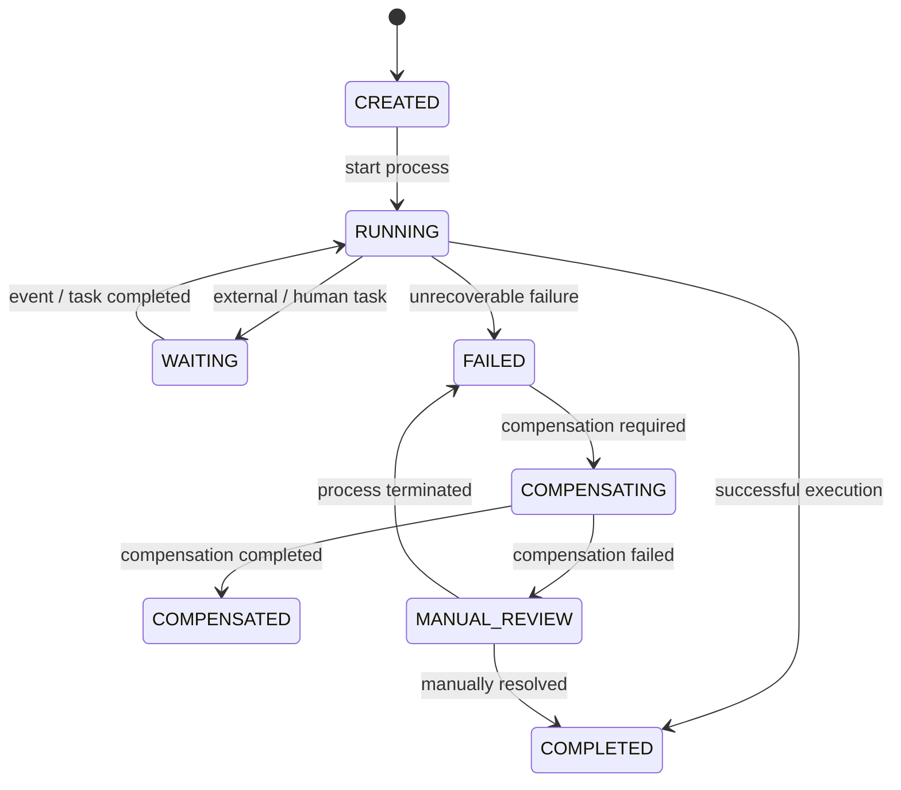

# Process State Management

## Purpose

Long-running business processes require explicit and durable state management.

A process may execute across multiple services, external systems and human tasks. The architecture therefore cannot rely on transient application memory to determine the current process state.

The process state must remain recoverable after:

• service restart;
• workflow-engine restart;
• network failure;
• external system timeout;
• process retry;
• operator intervention.

## Process State vs Business State

The architecture distinguishes between three different types of state:

### Workflow Execution State

Technical state describing where the workflow is in its execution lifecycle.

Examples:

• current process step;
• waiting state;
• retry state;
• timer state;
• compensation state.

### Business Operation State

State describing the business operation itself.

Examples:

• payment created;
• payment authorized;
• payment completed;
• payment declined.

### External System State

State maintained by an external system participating in the process.

Examples:

• external payment status;
• settlement status;
• confirmation status;
• external operation state.

These states should not be implicitly treated as the same state.

## State Ownership

Every important state should have an explicit owner.

The workflow engine owns workflow execution state.

A business service owns its domain-specific business state.

An external system owns the state of its own operation.

The workflow should coordinate these states rather than silently replacing the ownership model of participating systems.

## Example Process State Model



## State Transition Principles

State transitions should be explicit.

A transition should have:

• current state;
• triggering event or action;
• resulting state;
• validation rules;
• owner;
• timestamp;
• correlation information.

Invalid transitions should be rejected or handled explicitly.

For example:

```text
CREATED → RUNNING
RUNNING → WAITING
WAITING → RUNNING
RUNNING → COMPLETED
RUNNING → FAILED
FAILED → COMPENSATING
COMPENSATING → COMPENSATED
```

A process should not silently move from an arbitrary state to another state without a defined transition.

## Durable State

For long-running processes, state must survive application and infrastructure failures.

The architecture should therefore avoid relying exclusively on:

• in-memory variables;
• local application sessions;
• temporary caches;
• client-side state.

Durable state may be maintained by the workflow engine and/or dedicated persistence depending on the architecture.

## Correlation

Every process instance should have a stable process identifier.

Where applicable, the process should also maintain:

• business operation ID;
• correlation ID;
• external operation ID;
• request ID.

This allows the process execution to be correlated with participating services and external systems.

## Unknown State

A timeout does not necessarily mean that the business operation failed.

For example:

```text
Workflow
   |
   | request
   v
External System
   |
   | operation executed
   |
   X response lost
   |
Workflow receives timeout
```

The workflow therefore may need to enter a controlled waiting or reconciliation state instead of immediately marking the business operation as failed.

## State Recovery

After a failure, the process should be recoverable from durable state.

Recovery should determine:

1. current process state;
2. last successfully completed step;
3. pending operation;
4. retry status;
5. external operation status;
6. required compensation;
7. whether manual intervention is required.

## State Management Principles

• Process state must be explicit.
• Process state must be durable.
• State ownership must be clear.
• Workflow state must not replace business-state ownership.
• Invalid transitions must be controlled.
• Unknown external outcomes must not automatically become failures.
• State changes should be observable and auditable.
• Process recovery should be deterministic where possible.
