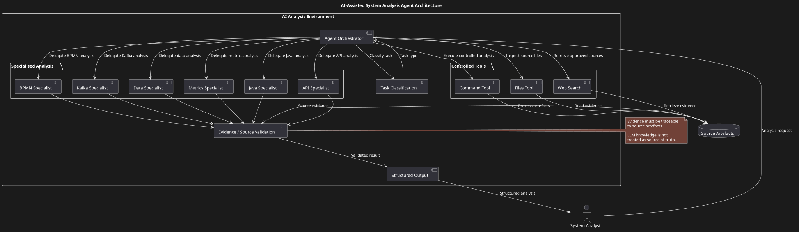
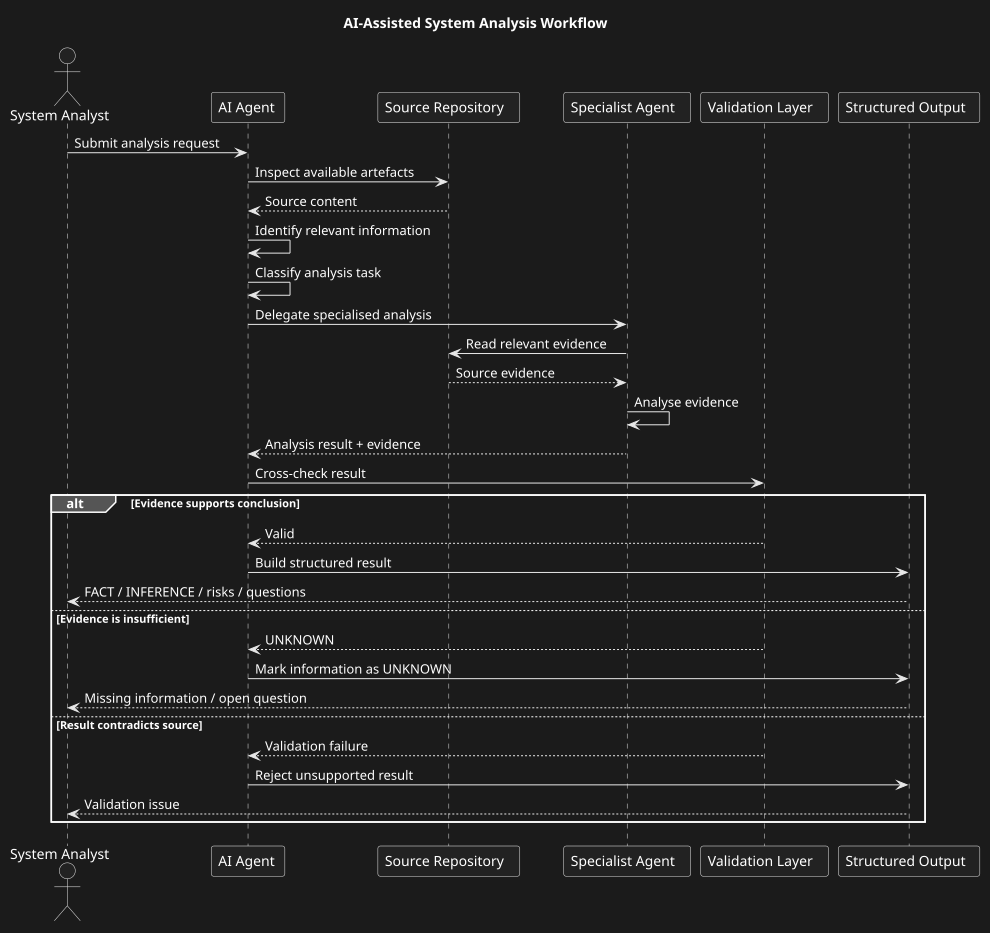
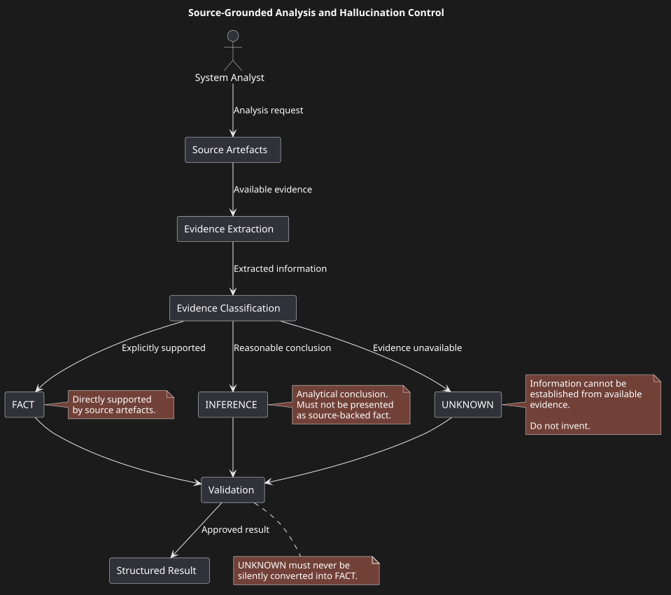

# AI-Assisted System Analysis Agent

## Overview

This case study demonstrates the architecture of an AI-assisted system analysis agent designed to support software analysts during requirements analysis, architecture analysis and technical documentation.

The solution combines an LLM with controlled tools, specialised analytical agents, structured prompts and validation rules.

The primary design principle is:

> **The agent must distinguish between facts obtained from source artefacts and its own analytical conclusions.**

## Problem

System analysts regularly perform repetitive activities:

• reading large technical documents;
• analysing API specifications;
• reviewing Kafka contracts;
• extracting business rules;
• identifying missing requirements;
• analysing dependencies;
• preparing technical documentation;
• checking consistency between artefacts.

These activities consume significant analyst time while often following repeatable patterns.

## Objective

Create an AI-assisted workflow that can:

1. inspect source artefacts;
2. identify relevant information;
3. delegate specialised analysis;
4. produce structured results;
5. explicitly identify missing information;
6. avoid inventing technical facts;
7. generate reusable documentation.

## Core Principle

> **The agent is a detective, not an architect.**

The agent must analyse available evidence and identify what is explicitly present in the source material.

It must not invent:

• APIs;
• endpoints;
• Kafka topics;
• database tables;
• BPMN processes;
• business rules;
• metrics;
• configuration values;
• architecture components.

When information cannot be established from the available sources, the agent must explicitly report:

The production agent works in Russian, so its markers are Russian: `НЕ НАЙДЕНО` means "NOT FOUND" and `ОТСУТСТВУЕТ` means "ABSENT". In this English portfolio they are equal to `UNKNOWN`.


```text
НЕ НАЙДЕНО
```

or

```text
ОТСУТСТВУЕТ
```

The system distinguishes between:

• FACT — explicitly supported by source material;
• INFERENCE — reasoned interpretation;
• UNKNOWN — cannot be established from available evidence.

This separation is a core hallucination-control mechanism.

## High-Level Architecture

```text
                    ┌────────────────────┐
                    │      Analyst       │
                    └─────────┬──────────┘
                              │
                              ▼
                    ┌────────────────────┐
                    │    AI Agent        │
                    │  Orchestrator      │
                    └─────────┬──────────┘
                              │
             ┌────────────────┼────────────────┐
             ▼                ▼                ▼
        ┌─────────┐      ┌─────────┐      ┌─────────┐
        │ Files   │      │  Web    │      │Command  │
        │ Tool    │      │ Search  │      │ Tool    │
        └─────────┘      └─────────┘      └─────────┘
                              │
                              ▼
                    ┌────────────────────┐
                    │ Specialised        │
                    │ Subagents          │
                    └─────────┬──────────┘
                              │
       ┌──────────────┬───────┼────────┬──────────────┐
       ▼              ▼       ▼        ▼              ▼
      API           BPMN     Kafka    Data          Metrics
    Specialist    Specialist Specialist Specialist Specialist
       │              │       │        │              │
       └──────────────┴───────┼────────┴──────────────┘
                              ▼
                    ┌────────────────────┐
                    │ Validation Layer   │
                    └─────────┬──────────┘
                              ▼
                    ┌────────────────────┐
                    │ Structured Output  │
                    └────────────────────┘
```
## Architecture Diagrams

### Agent Architecture



The diagram shows the main architectural components of the AI-assisted analysis environment, including the orchestrator, controlled tools, specialised analytical agents and the validation layer.

### Analysis Workflow



The workflow illustrates how an analysis request is processed from source inspection through specialised analysis and validation to the final structured result.

### Hallucination Control



The diagram shows how source evidence is classified into FACT, INFERENCE and UNKNOWN before the result is accepted by the validation layer.

## Tools

The agent can operate through controlled tools such as:

• file listing;
• file reading;
• file writing;
• command execution;
• web search;
• URL retrieval.

Tools are invoked explicitly rather than allowing the LLM to assume access to unavailable information.

## Specialised Subagents

Different analytical domains are delegated to specialised components:

• API specialist;
• BPMN specialist;
• Kafka specialist;
• data specialist;
• metrics specialist;
• Java specialist.

This allows domain-specific instructions and validation rules to be isolated.

## Typical Workflow

```text
Source Artefacts
      ↓
Source Inspection
      ↓
Relevant Information Extraction
      ↓
Task Classification
      ↓
Specialist Analysis
      ↓
Cross-check
      ↓
Validation
      ↓
Structured Result
      ↓
Documentation
```

## Example Tasks

The agent can assist with:

Requirements

• extract requirements;
• identify ambiguity;
• detect missing acceptance criteria;
• classify functional/non-functional requirements.

API

• analyse OpenAPI;
• identify endpoints;
• inspect request/response models;
• identify error contracts;
• generate API documentation.

Kafka

• analyse topics;
• identify producers and consumers;
• inspect event schemas;
• identify partitioning requirements;
• document delivery semantics.

BPMN

• analyse process flows;
• identify states and transitions;
• detect missing branches;
• produce structured process documentation.

Database

• analyse schemas;
• identify entities and relationships;
• document ownership;
• identify retention considerations.

## Hallucination Control

The architecture explicitly separates:

```text
FACT
  ↓
Source-backed information

INFERENCE
  ↓
Analytical conclusion

UNKNOWN
  ↓
Information not available
```

The agent must not silently convert UNKNOWN into FACT.

## Output

The preferred output is structured and source-grounded.

Each analytical result should clearly distinguish:

• source-backed facts;
• analytical conclusions;
• unavailable information;
• open questions;
• identified risks;
• recommendations.

Where possible, facts should contain source provenance such as the source file, section, endpoint, message definition or other identifiable artefact reference.

Example:

```json
{
  "facts": [
    {
      "statement": "POST /payments is defined in the API specification.",
      "source": "openapi.yaml",
      "location": "paths./payments.post"
    }
  ],
  "inferences": [],
  "unknown": [],
  "openQuestions": [],
  "risks": [],
  "recommendations": []
}
```
Source provenance makes the result easier to verify and reduces the risk of presenting unsupported LLM output as an established technical fact.

## Security

The agent operates within explicit security boundaries.

Security controls of this agent and their implementation status are listed in [evaluation.md](./evaluation.md#security-controls-status). The controls are:

• access control for source artefacts and tools;
• data classification before sending content to the LLM;
• isolation of confidential and restricted information;
• prompt injection protection;
• explicit tool permissions;
• allowlists for executable commands and external URLs;
• secret handling and credential isolation;
• audit logging of tool invocations;
• controlled outbound network access;
• retention and deletion policies for analysis artefacts.

Tools must not automatically inherit unrestricted access to the environment.

The agent should only access information and capabilities explicitly granted to it.

External web sources should be treated as untrusted input and must not override source artefacts or internal validation rules.

## Architecture Trade-offs

The solution deliberately favours controlled and explainable analysis over unrestricted autonomous behaviour.

### LLM autonomy vs source control

A fully autonomous agent could generate broader answers, but would increase the risk of unsupported technical assumptions.

The design therefore limits the LLM through explicit tools, source inspection and validation rules.

### Single general agent vs specialised agents

A single general-purpose agent simplifies orchestration but increases prompt complexity and makes domain-specific validation harder.

Specialised agents allow separate instructions and validation rules for API, BPMN, Kafka, data, metrics and Java analysis.

### Knowledge breadth vs reliability

The system does not treat the LLM's general knowledge as authoritative for project-specific technical facts.

Source artefacts remain the primary evidence for project analysis.

### Automation vs human responsibility

The agent automates repetitive analytical activities but does not make final architectural or business decisions.

The analyst remains responsible for validating conclusions and making decisions.

## Limitations

The agent does not replace architectural ownership or business decision-making.

LLM output must be treated as an analytical aid and validated against source artefacts.

Known failure modes include:

• incomplete or outdated source artefacts;
• ambiguous requirements;
• conflicting information across documents;
• insufficient evidence for a requested conclusion;
• incorrect interpretation of domain terminology;
• tool execution failures;
• incomplete repository inspection;
• prompt injection attempts;
• unsupported assumptions generated by the LLM;
• incorrect analytical conclusions despite valid source evidence.

The architecture therefore treats uncertainty as an explicit result rather than forcing the system to produce an answer.

When evidence is insufficient, the expected result is UNKNOWN, НЕ НАЙДЕНО or ОТСУТСТВУЕТ rather than an invented technical detail.

## Personal Contribution

The case reflects my experience designing AI-assisted analytical workflows and adapting LLM-based tooling to system analysis tasks.

Key areas include:

• agent architecture;
• system prompts;
• tool design;
• specialised subagents;
• structured output;
• hallucination prevention;
• analytical workflow design;
• technical documentation automation.

Evidence: the evaluation method and results are in [evaluation.md](./evaluation.md).

## My Role

Role: System Analyst / AI-Assisted Solution Designer

Responsibilities

• AI-assisted analysis workflow design;
• agent architecture;
• tool orchestration;
• specialist agent decomposition;
• system prompt design;
• structured output design;
• source-grounded analysis;
• hallucination control;
• validation workflow;
• analysis result verification;
• documentation generation;
• definition of AI limitations and boundaries.

## Portfolio Note

This is a reconstructed and sanitised portfolio case based on an AI-assisted system analysis approach.

The case demonstrates architecture and engineering principles rather than exposing proprietary implementation details, credentials, internal data or confidential documentation.
